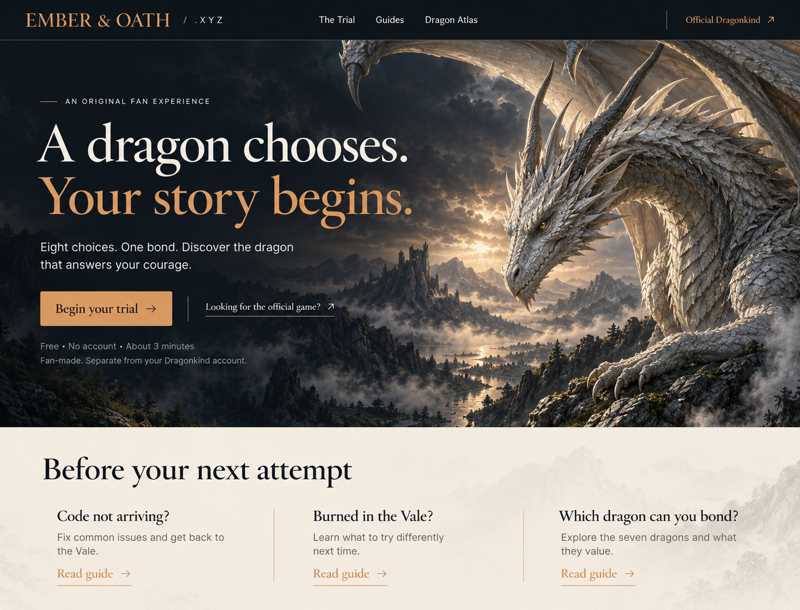
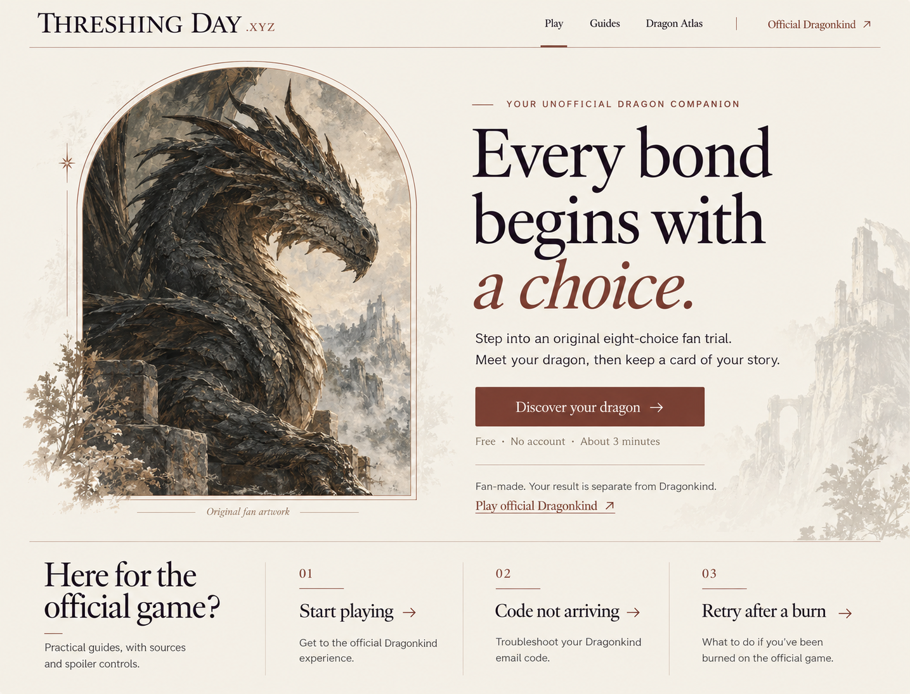
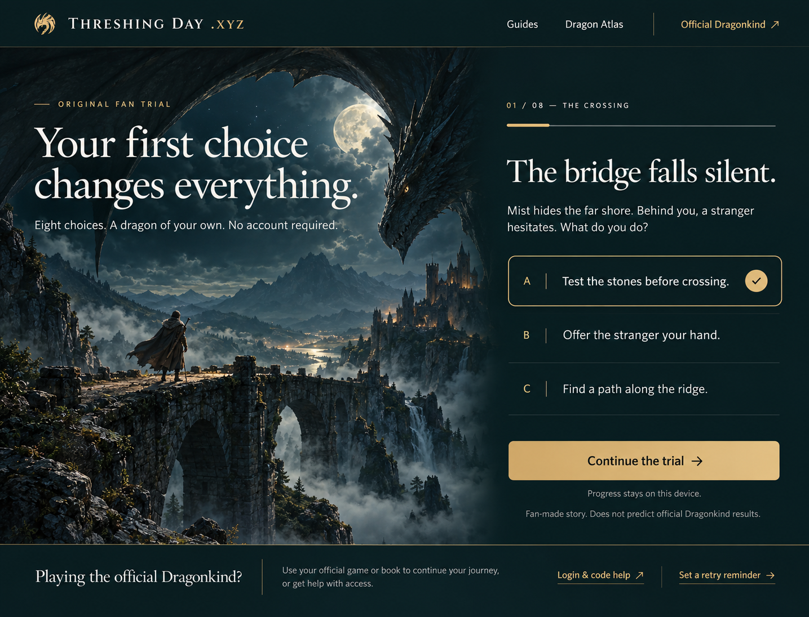

# threshingdaygame.xyz UI 设计规范

版本：设计评审 v0.1 · 2026-10-04  
状态：三方向候选，未获用户选定；没有网页代码。聊天中的显示顺序对应下列 01 / 02 / 03 文件。

## 视觉目标

气质：有收藏价值的奇幻插画、精致出版物排版、清楚易用的游戏界面。避免塞满徽章、计数器、卡片套卡片。全站统一品牌文字为 THRESHING DAY .XYZ，域名 threshingdaygame.xyz。原创测试、官方游戏帮助、书籍内容应各自清楚标识。

## 三张高保真方向稿

### 01

### 02

### 03（建议用于进一步收敛）

以上均为单张 1440 宽级别的桌面视觉探索，不是运行中的页面，也不代表所有像素或文字已经定稿。

## 推荐基础规范（以 03 为起点，待选择）

| 项目 | 设计值 |
| --- | --- |
| 主背景 | 深青黑 #11272A |
| 次背景 | #193337 |
| 正文 | 象牙白 #F3EEE4 |
| 次要文字 | #BAC8C5 |
| 主行动 | 哑金 #D4B780，深色按钮文字 |
| 内容阅读区 | 象牙白 #F3EEE4 配 #182A2C 正文 |
| 分隔线 | 低饱和灰绿 #45605F |
| 危险/错误 | #E6A094 配文字说明，不只用颜色 |
| 字体建议 | Cormorant Garamond 作展示标题；Inter 作正文/UI；需开发时核验字体许可与实际渲染 |
| 桌面标题 | H1 56–64px / 1.06，H2 36–40px；不把整段正文改成衬线大写 |
| 手机标题 | H1 32–36px / 1.12，题目 26–30px |
| 正文 | 16px / 1.6；说明文字至少 14px；长文 18px / 1.7 |
| 页面边距 | 桌面 48–64px，手机 20px |
| 网格 | 12 列，内容上限 1280px；阅读正文 680px |
| 间距 | 8/12/16/24/32/48/64/96px |
| 圆角 | 按钮 6px，选项 8px，分享卡 12px；避免所有元素胶囊化 |
| 操作区 | 点击目标至少 44×44px；题目选项至少 64px 高 |

这些是拟采用的设计参数，不是对候选图精确取色或对比度测量结果。开发验收需对正文、按钮、禁用、焦点逐一检查。

## 页面模板与状态

### 首页 / 试炼

桌面：72px 顶栏，左侧情境插画与一句引导，右侧可阅读的纯色题目区域。第一个选项开始前不预选；选择后才展示勾选和 Continue。进入下一题后收起大号营销标题，让剧情、选择和进度优先。

导航保持 Guides、Dragon Atlas、Official Dragonkind；不在同一行同时放 7–8 个入口。页脚保留独立站说明、来源与必要政策。

手机 390×844 设计：64px 顶栏 → 简短 Fan-made 标签/标题 → 120–160px 情境图 → 第 1/8 题、短剧情 → 三个全宽选项 → Continue。若内容超过一屏，允许自然滚动，按钮不得盖住最后一个选项；完整试炼页面优先题目而不是大幅主图。菜单中保留明确官方外链。桌面的大龙特写需单独构图的手机裁切，不能简单居中截头。

状态：未选 / 已选 / 切题 / 返回 / 继续已有进度 / 重新开始 / 存储不可用。切题时将键盘焦点移到题目标题，进度以“Question 2 of 8”可读文字提供。动效建议 180–240ms；遵循减少动态效果偏好；不以逐字动画阻止阅读。

### 结果页

桌面：左侧 4:5 结果卡，右侧名字/称号、两项主要倾向、为什么得到它、保存与分享。手机：卡片 → 简短解释 → 保存图片主按钮 → 复制链接和重玩。

卡片内容固定为：原创龙图、原创名、短称号、两项特征、Fan-made result、threshingdaygame.xyz。所有分享图都带上述身份标签。避免官方 logo、官方认证标志、虚构稀有度百分比。

状态：生成中 / 成功 / 下载失败 / 链接复制失败 / 本地已收藏 / 版本过期。加载失败仍显示文字结果并允许重试导出。

### 攻略页

视觉为浅色阅读底，保留深色窄顶栏。标题下放核查日期和来源等级，紧接 2–3 句直接答案。桌面目录在右侧，手机目录折叠。剧透块默认收起，按钮明确说 Reveal scene details，而不是模糊的 More。

重试页面内嵌计时器，不增加弹窗或悬浮球：Hours / Minutes 输入、Start reminder、结束时刻、本地保存说明。没有输入不启动。不能以绿色状态灯宣称官方服务正常，除非后续有真实监测证据。

### 图鉴页

6 色入口和尾型说明可以紧凑排列。官方事实、社区观察、原创测试人格分栏。首版不显示由未核实样本计算的掉率。图片 alt 说明形象与颜色，交互不能只依赖颜色。

## 候选图已发现的文字与品牌修正

- 01 图把内部方向名 EMBER & OATH 放成了站名：定稿应改为 THRESHING DAY .XYZ。
- 01 图出现“seven dragons”字样：不采用。官方 FAQ 只证实各种颜色与尾型有可能，六色可由官方商店分类辅助核验；官网图鉴须以核验后的内容为准。
- 01 的浅银龙仅是原创艺术概念，不应让用户误认成官方可获得的新颜色；若采用，应改为清楚的原创设定或已计划的颜色。
- 03 选中 A 的状态只用于展示交互样式；实际首次访问必须无预选。
- 03 底部 “Use your official game or book...” 文案不自然：改为 “Find login help and keep track of your next attempt.”
- 三图均须在正式 H1/标题系统中保留 Threshing Day Game 主词，并核查手机实际字号、对比度、焦点、按钮文本与插画裁切。

## 定稿验收表

用户选定后补齐：桌面首页、390px 手机首页、答题选中/未选、结果页/分享图、攻略/计时器。现阶段只完成三张桌面方向，不声称移动高保真稿或完整 Figma 组件库已经交付。

验收重点：品牌名称一致；主行动一眼可见；官方与粉丝体验清晰；没有假数字；题目正文不覆盖复杂图片；触控与键盘均可操作；示例与真实用户结果有区分；所有文案基于事实等级审阅。视觉选择不构成开发授权，本轮用户已明确先不要开发。
