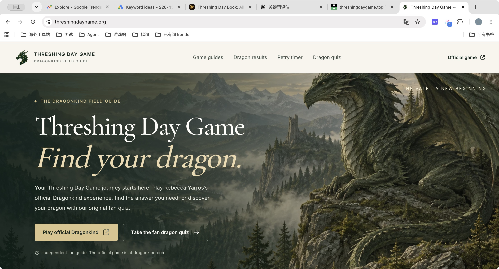
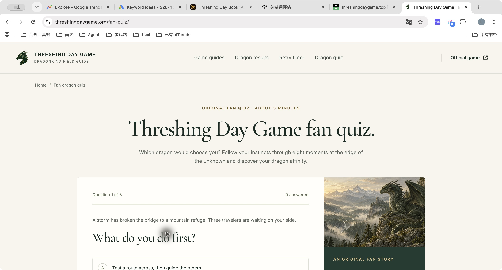
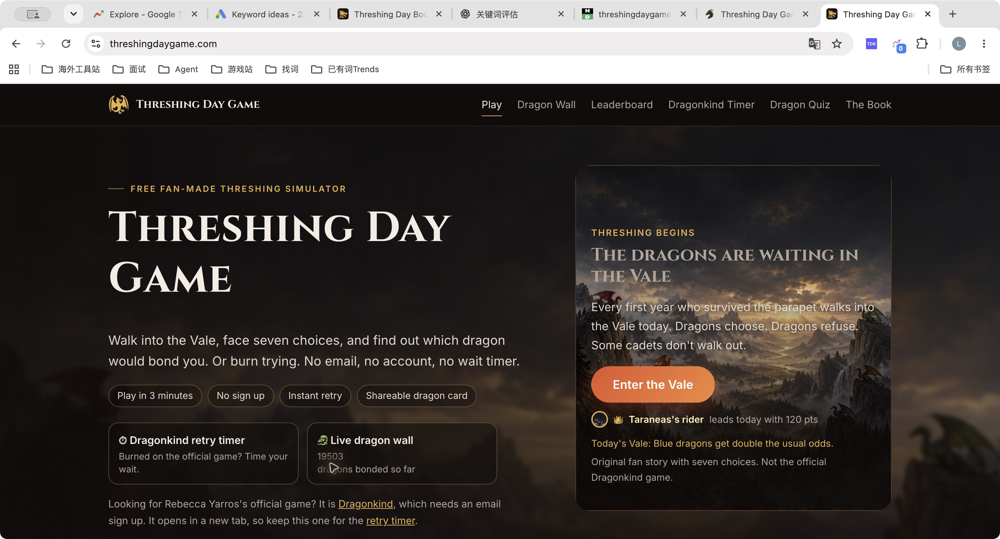
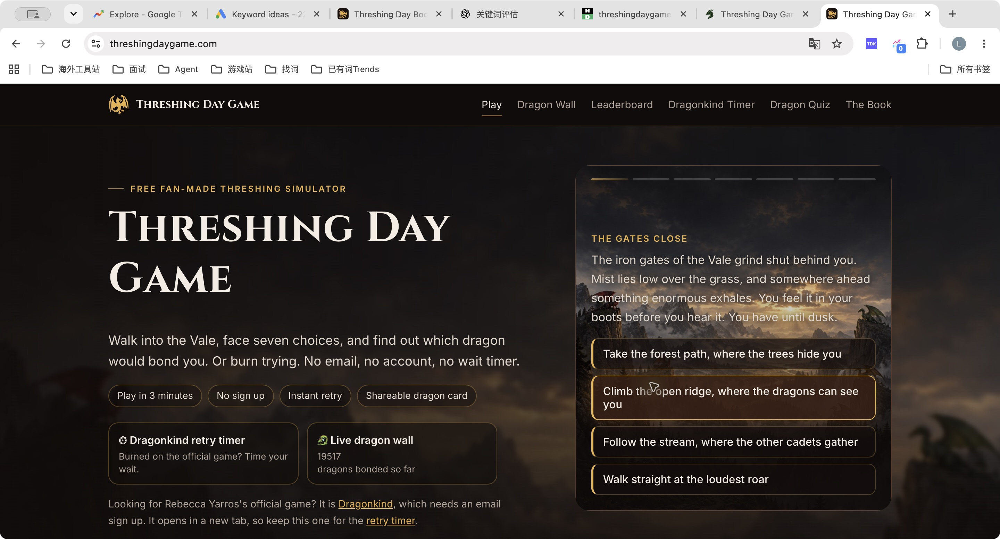

# threshingdaygame.xyz：研究与实现方案

日期：2026-10-04（Asia/Shanghai）  
状态：研究完成，三张 UI 方向稿已生成；视觉方向待用户选择，尚未开发。  
默认受众：英语 Fourth Wing / Empyrean 读者及 Dragonkind 玩家；移动端优先。此语言与受众选择是建议，不是已有访客数据。

## 1. 建议与判断边界

建议做「原创龙契试炼 + Dragonkind 实用指南」的小型独立站。主循环为：搜索/分享进入 → 直接做第一次选择 → 完成约 3 分钟试炼 → 得到有收藏感的龙契卡 → 保存或分享 → 阅读官方游戏帮助。

需求存在：玩家反复询问登录、重试、龙的结果，并主动展示自己的龙和寻找同队伙伴。独立站已经把这些需求产品化。当前竞争门槛不是“有没有攻略和测试”，而是试炼的完成体验、结果的吸引力和信息准确性。

这仍然是一次热点验证。此次没有取得 Google Trends 时间序列、Keyword Planner 搜索量、竞品真实流量或收入数据，不能据 Reddit 热帖推导月搜索量、排名难度、收益或热度持续时间。竞争站展示的结契数也不是经审计的独立访客数。

商业假设：粉丝愿意在官方体验之外玩一个原创短试炼、保存卡片。该假设弱于“用户需要官方登录和重试帮助”的证据，需上线后验证。先控制首版范围，不以建立大型社区作为前置条件。

## 2. 实际需求证据

| 用户任务 | 本次观察到的依据 | 对应产品决策 | 证据边界 |
| --- | --- | --- | --- |
| 找到正确的官方游戏 | 官方 Dragonkind 首页出现候选人入口、邮箱登录；竞品均解释官方与粉丝体验区别 | 所有页面清楚提供 Official Dragonkind 外链；原创试炼 CTA 明示 Fan-made | 不假装连接官方账号 |
| 验证码不到、页面不能用 | Reddit 首个 Master Post 大量讨论崩溃与卡在入口；作者 FAQ 说明代码分批发送、检查垃圾箱 | 独立登录帮助页，先给官方 FAQ 结论，再给合理排查步骤 | 10 月 1 日的崩溃反馈不代表 10 月 4 日仍宕机 |
| 死亡后何时重试 | 作者 FAQ 说数小时后可重试且可反复尝试；Reddit 第三帖汇总提及 4 小时 | 明确小时/分钟的个人计时器，优先用户输入官方剩余时长 | 不把竞品的 4:00 擅自解释为 4 分钟；不声称同步官方 |
| 找到黑龙/蓝龙或正确答案 | 第二个 Master Post 反复问路线；第三帖版主说明没有特定方法获得黑/蓝龙 | 高优先级“已知与未知”指南，分离官方说明与社区观察 | 不能据社区描述证明官方算法；不给必中承诺 |
| 展示自己的龙、寻找归属 | 第二帖出现大量分享、找 squad mates、希望投票统计颜色；第三帖讨论龙/小队 flair | 首版结果卡下载与本地收藏；后续再验证官方结果手动记录及社区展示 | 社区样本自选择，不能当作官方稀有度概率 |
| 不想被剧透 | Master Post 标题明确警告网站剧透；书籍讨论也区分剧透 | 攻略默认只显示无剧透摘要，具体场景须主动展开 | 原创试炼本身不使用小说关键剧情 |

主要原始来源：

- [官方游戏入口](https://dragonkind.com/)
- [作者 FAQ（本次可读的官方 Squarespace 站点）](https://rebecca-yarros.squarespace.com/faqs)
- [Reddit：Dragonkind Master Post，10 月 1 日](https://www.reddit.com/r/fourthwing/comments/1wupoud/dragonkind_master_post_will_contain_spoilers_for/)
- [Reddit：Masterpost Part 2，10 月 1 日起](https://www.reddit.com/r/fourthwing/comments/1wuyvem/dragonkind_masterpost_pt_2_will_contain_spoilers/)
- [Reddit：Dragon Bonding Megathread Part 3](https://www.reddit.com/r/fourthwing/comments/1wvwfp9/dragonkind_dragon_bonding_megathread_part_3/)

## 3. 竞品拆解

| 维度 | threshingdaygame.org | threshingdaygame.com | .xyz 的建议 |
| --- | --- | --- | --- |
| 主定位 | 官方导流、Field Guide、原创粉丝测试 | 首页内置粉丝模拟器、游戏化留存 | 直接体验原创试炼，官方帮助清晰可达 |
| 实际功能 | 指南、结果解释、重试计时器、8 题/6 倾向测试、来源说明 | 7 步试炼、即时重试、龙墙、排行榜、官方结果录入、测试、书籍内容 | 先做好试炼、结果卡、4 类指南、轻量计时器 |
| 视觉 | 米白、深绿、衬线大标题、龙与山谷插画 | 黑金、橙色 CTA、背景图、信息卡、统计 | 保留奇幻品质，减少装饰与文字竞争，增加专注答题空间 |
| 转化 | 首屏主按钮去官方，站内测试次要 | 首屏按钮直接进入试炼 | 站内主行动直接答题；官方外链始终可见 |
| 内容可信度 | 强调官方来源、原创规则不预测官方结果 | 有官方/粉丝区分，但指南也传播未确认电量理论；4:00 单位不清 | 来源分级、核查日期、清晰单位；不传播无证实技巧 |
| 商业线索 | 当前查看页面未见明确广告变现证据 | 页脚披露 Amazon Associate；有书籍版本购买内容 | 初期以体验数据验证为主，后续再评估书籍导购及内容页广告 |

补充样本 [threshinggame.com](https://threshinggame.com/) 的公开页面提供 10 场景、快速测试与 Signet 测试，进一步表明“原创文字试炼”已有竞争。本次只做其内容研究，没有对它作截图视觉审计。

### 本次截图与流程审计

捕获时间为 2026-10-04，使用真实浏览器页面。内置浏览器导航超时后改用 Chrome；.org 在搜索抓取工具中不可达，但在 Chrome 成功打开。以下均为此次实际截图，已重新打开检查。

1. **.org 首页：整体清晰。** 官方与粉丝入口标签明确，插画和字体品质好。大幅首屏留给氛围，问题帮助需下滚。图上小字叠于纹理背景，对比度需后续测量。

2. **.org 测试入口：结构完整，但进入答题较慢。** 页面标题和引导占据大段高度，捕获视口中答案在折叠线附近；第一题 DOM 可见单选、上一题/下一题与本地保存提示。未完成全部八题或验证保存功能。

3. **.com 首页：开玩入口突出，信息竞争偏多。** 主按钮在右侧，左侧同时出现计时器、龙墙、官方解释；页面导航和正文列出排行榜等功能。动态结契数仅证实页面显示数字，不证实流量真实性。

4. **.com 开始试炼：点击成功进入第 1/7 步。** 观察到逐字呈现剧情，最终出现四个选项；营销介绍仍占左侧大面积，答题区文字覆盖背景图。可以借鉴一键开始，但建议开始后收起营销内容并使用纯色阅读区域。

审计范围：两站桌面首页、测试入口/首题；没有全流程通关，没有提交结果、加入排行榜或录入公开龙墙，没有测移动真机、屏幕阅读器、键盘全流程、真实网络性能或源代码。因此不能声称竞品全面无障碍通过、移动端有缺陷或存在伪造统计。

## 4. 首版产品范围

### P0：先验证“玩完且愿意保留”

- 首页即可开始的原创试炼：8 个决策节点，每题 3 个有意义选项，单题正文约 35–60 英文词；完整体验目标 3–5 分钟。
- 结果卡：原创龙形象、原创名/称号、两项主要性格倾向、一段“为什么它选择你”；明确 Fan-made result。支持保存图片、复制结果链接、本机收藏、重新探索。
- 指南首页和四个任务：怎么玩/官方入口、验证码不到、死亡重试、黑蓝龙与答案是否可信。
- 一个龙图鉴概览：官方已公开颜色/尾型事实与本站原创人格设定分栏。没有足够内容时不批量拆成几十个空泛详情页。
- 轻量个人计时器嵌入重试帮助页：设置时/分、剩余时长、预计结束时间、编辑/清除；跨刷新恢复。只在当前设备计时。
- About、Sources、Privacy、Contact、404，以及实际页面所需的元信息与 sitemap。

### P1：看行为证据再做

- 玩家手动录入自己的官方龙结果，明确“手动记录，非官方同步”。
- 分享卡主题、好友结果对比、额外原创分支。
- 有足够真实样本后再做自愿投稿墙，显示样本量、时间与自报告标签；加入审核与删除机制。
- Signet/世界观内容：以可核验的新官方信息触发，而不是根据竞品日期设置假精确倒计时。

### 暂不安排

账号系统、聊天室、排行榜、每天概率翻倍、实时在线人数、批量翻译、复杂 3D、自动播放视频、调用官方私有 API、复制官方剧情或嵌入未经确认可嵌入的游戏。

## 5. 交互与数据规则

**原创试炼。** 建议首版围绕 courage / insight / loyalty 三种主倾向和两个辅助倾向编写内容。答案得分采用可解释、固定规则；主倾向决定结果原型，次倾向决定结果文案，同分规则固定。6 个原创结果原型全部可达，具体评分表须在内容定稿时审阅。这不是对官方算法的描述。

为了保证约 3 分钟的第一次体验能完成，首版建议没有随机猝死：可以出现挫折、代价和不同结局氛围，最终都得到结果。若后续加入挑战模式，应成为清楚标注的额外玩法。避免照搬官方等待机制，把用户已有的挫败感再复制一遍。

**状态。** 未选择时 Continue 禁用并提供简短说明；选中后显示明确勾选，点击确认才前进。支持返回上一题；修改早先答案后重新计算后续状态。页面刷新可继续；清除本地数据时说明会丢失进度。存储不可用时允许继续，并告知关闭页面不会保存。

**结果。** 标题、插画与主要结论优先；下载图片为主行动，复制链接为辅。导出 1080×1350 竖卡，包含域名与 Fan-made 标识。无用户输入的姓名/邮箱进入分享链接；链接只编码非敏感结果版本与原型。复制/分享失败时提供下载替代。分享页不自动发布到任何社交平台。

**计时器。** 不自动替用户设 4 小时，不自动读取或声称读取官方账号。用户输入官方页面显示的小时和分钟；保存绝对截止时间，刷新后重新计算。结束状态文案是“Your reminder has ended. Check Dragonkind.”，不能保证官方已解锁。关闭网页后不保证通知；首版用页面内提醒，无权限弹窗。

**来源与剧透。** 每篇攻略带核查日期及来源。分为 Official / Community report / Our suggestion 三类。默认显示无剧透摘要，具体情节用 Show scene details 手动展开，并保留选择。避免把 Reddit 推测提升为确定事实。

## 6. 信息架构与搜索意图

| 路由建议 | 主任务/意图 | 主要转化 |
| --- | --- | --- |
| `/` | threshing day game；立即试玩 | 第一次选择 |
| `/play/` | 恢复完整试炼/分享入口 | 完成试炼 |
| `/result/` | 个性化结果展示，通常不索引 | 保存、复制、重玩 |
| `/guides/` | 快速找到问题 | 进入具体帮助 |
| `/guides/how-to-play/` | 官方游戏是什么、在哪里玩 | 去官方或了解原创试炼 |
| `/guides/code-not-received/` | 登录码没收到 | 按官方信息排查 |
| `/guides/retry-cooldown/` | 死亡等待、重试时间 | 设置个人计时器 |
| `/guides/black-blue-dragons/` | 黑龙、蓝龙、正确答案 | 读有来源的已知/未知说明 |
| `/dragons/` | 颜色/尾型/结果含义 | 查看图鉴、试玩 |
| `/about/`、`/sources/`、`/privacy/`、`/contact/` | 网站身份和说明 | 信任与反馈 |

以上为搜索意图假设，不是查得的搜索量排序。首页 H1 必须包含 Threshing Day Game，同时可有更短的情绪标题。每篇攻略先用 2–3 句直接回答问题，再展开依据和操作。已知问题集中在一篇，避免“答案”“路线”“攻略”三篇重复。

首页下方顺序建议：当前试炼 → 官方游戏帮助 → 结果卡示例 → 精选图鉴 → FAQ → 来源/独立站说明。示例卡须标为 Sample，不能伪装成刚发生的玩家事件。

SEO 实施方向：静态可读正文、独立 title/description、canonical、站点地图、真实更新时间、合理站内链接；带查询参数的结果页不作为批量 SEO 页面。参考 [Google 的用户优先内容指南](https://developers.google.com/search/docs/fundamentals/creating-helpful-content)，不承诺 FAQ 富结果或排名。

## 7. 后续实现方案（本轮未执行）

建议采用 Astro + TypeScript，内容用 Markdown / 内容集合，试炼和计时器作为独立交互组件。理由是大量指南保持静态 HTML，只有必要区域加载交互脚本；这种架构与 [Astro Islands 文档](https://docs.astro.build/en/concepts/islands/) 一致。React 是否加入以组件复杂度为准，不为了首版引入整个 SPA。

数据结构预案：Scenario（id、正文、选项、得分、下一节点）；DragonArchetype（id、原创图、文案、结果规则版本）；Guide（slug、来源、核查时间、剧透等级）；LocalRun（版本、答案、当前题、结果）；RetryReminder（截止时间）。不需要官方账号接口或首版数据库。

视觉素材：1 张主视觉、2–3 张场景图、6 张原创结果插画、品牌字标/图标、分享卡底图。统一美术规则，生成后人工检查。竞品截图只作研究证据，不能用作本站资产；官方图像也不直接当作自有素材。

部署方向仅预案：静态 CDN 托管与自有域名绑定；实际平台在开发阶段按用户现有部署习惯决定。当前没有部署、绑定域名、创建账号或安装项目依赖。

阶段预估（不是交付承诺）：

1. 设计收敛：选择一张方向，补齐桌面/移动首页、题目、结果、攻略四类模板。
2. 核心实现：1–2 个工作日，完成试炼引擎、持久化、结果卡与响应式布局。
3. 内容和视觉：约 1–2 个工作日，可与核心实现交叉，主要取决于原创文案和插画修订量。
4. 验证和发布准备：约半天，完成路径测试、分享导出、阅读/性能/搜索基础检查。

上线验收目标：360/390/768/1440 宽度无横向溢出；键盘可完成试炼；全部结果可达；同一答案同一版本得到同一结果；恢复进度、回退修改、过期计时器、存储失效有明确行为；分享卡无截字。性能目标 LCP ≤2.5s、CLS ≤0.1、INP ≤200ms（目标，当前未测），初始移动插画尽量 ≤250KB，首屏不要预加载全套结果图。

## 8. 验证投入是否值得

优先观察四个指标：来自搜索的有效入口、试炼开始率、完成率、结果保存/分享操作率。补充看指南→官方链接点击、计时器设置和 7 日回访。官方外链点击也是解决用户问题的成功，不应全部当作流失。

建议先用至少 200 次有效试炼开始形成方向性样本；完成率 60%、结果保存/分享操作率 10% 可作为内部优化目标，不是行业基准。低于目标先看逐题掉队与设备差异，再决定改文案还是砍功能。7–14 天复盘实际搜索展示、查询词与体验数据；新域名收录滞后不等于完全无需求，也不能无限延长投入。

首版不设置订阅墙。后续变现可探索书籍版本导购和攻略页广告；需另外验证转化与体验影响。问答过程、结果揭晓和分享卡保持清楚，不用广告打断核心任务。

## 9. 当前交付与未决项

- 已交付：本研究/实现方案、四张竞品证据截图、三张独立高保真桌面 UI 方向稿、UI 与交互规范。
- 推荐视觉：按聊天显示顺序第 3 张，理由是首页直接出现第一次决策，有助于检验“立即开玩”的产品定位。推荐不是用户已选定。
- 待用户决定：选择 1/2/3 或组合偏好；之后继续设计细化，不自动进入开发。
- 图像生成稿是视觉探索，不能作为全部文案的事实依据。具体修正列在 UI 规范中。
- 工作目录原为空且不是 Git 仓库。遵循用户约定，未自动初始化仓库，因此本轮设计文件无 commit。
